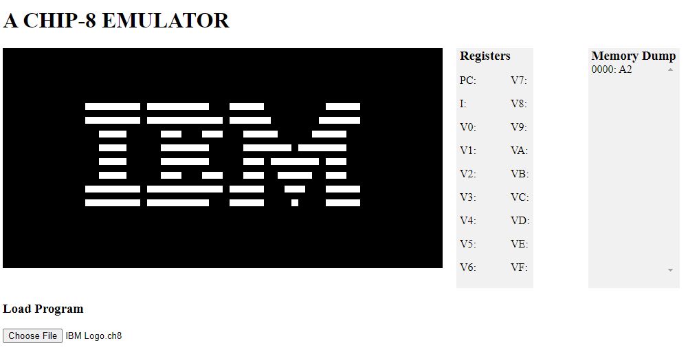

# chip8
A CHIP-8 emulator in Javascript.
In [Guide to making a CHIP-8 emulator](https://tobiasvl.github.io/blog/write-a-chip-8-emulator/), a tip was to implement the following instructions first:
- 00E0 (clear screen)
- 1NNN (jump)
- 6XNN (set register VX)
- 7XNN (add value to register VX)
- ANNN (set index register I)
- DXYN (display/draw)
to be able to run the **IBM logo program**. The program prints out the IBM logo and enters into an infinite loop

## Resourses that helped
1. [Cowgod's Chip-8 Technical Reference](http://devernay.free.fr/hacks/chip8/C8TECH10.HTM)
2. [Guide to making a CHIP-8 emulator](https://tobiasvl.github.io/blog/write-a-chip-8-emulator/)
